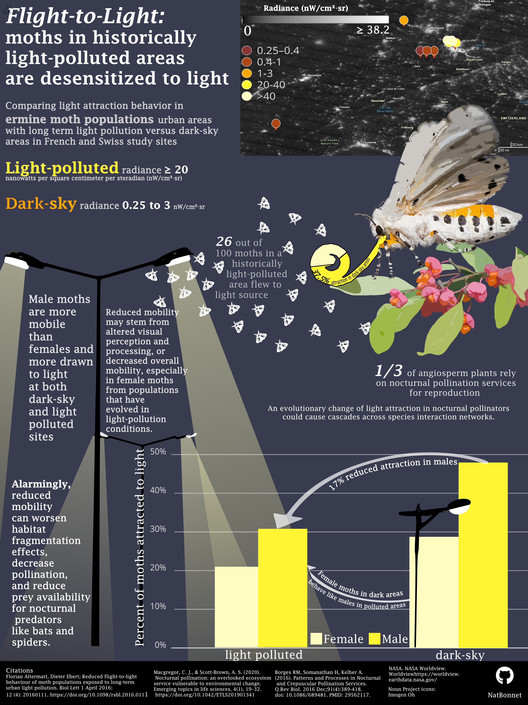
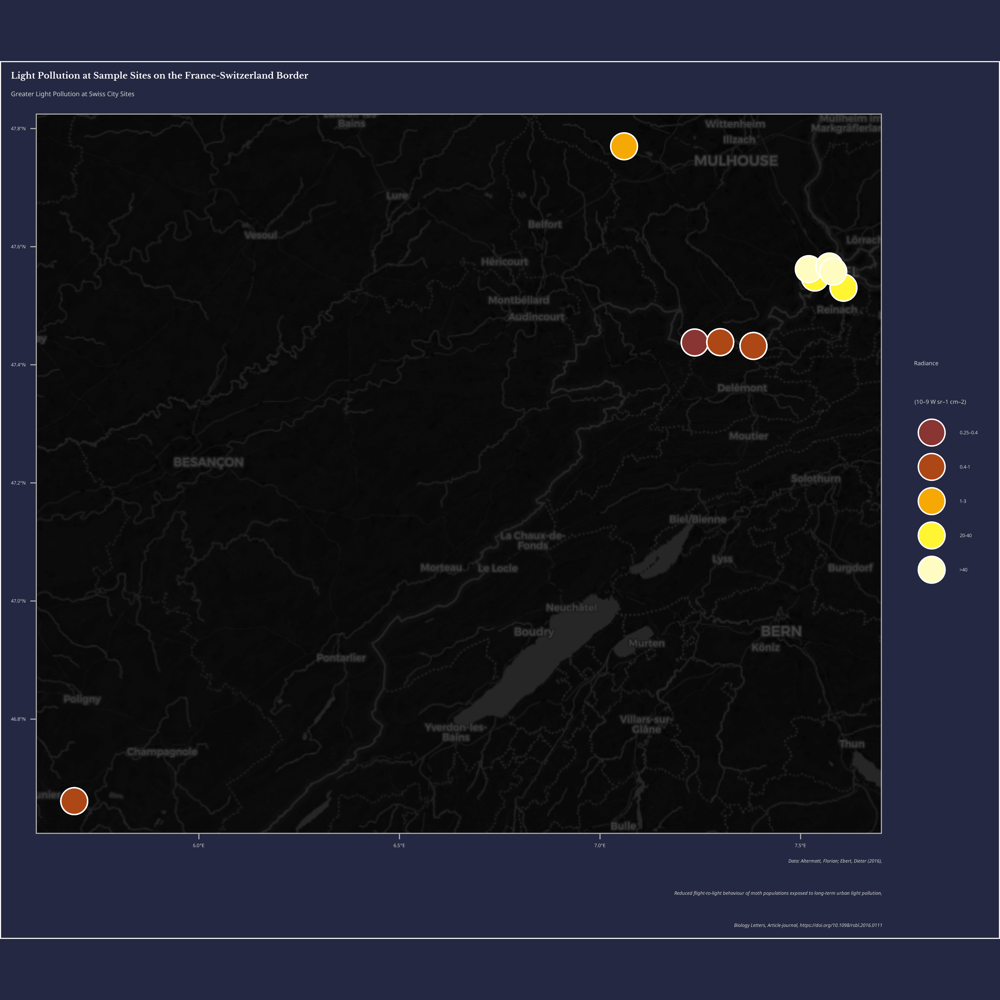

::: {style="text-align: center; margin: 2rem auto; max-width: 60%;"}
***"Thus hath the candle singed the moth."***

— William Shakespeare
:::

The importance of pollination as an ecosystem service is well known in the light of popular insects like honey bees and bumblebees. But what about what happens in the dark? Though diurnal pollinators cannot be discounted, 1/3 of angiosperm (flowering) plants are known to be pollinated by nocturnal animals [@borges2016]. This integral role supports species interaction networks that promote biodiversity, and contribute to human food security. Of these important pollinator groups, lepidoptera (moths and butterflies) play a big part. Nocturnally active pollinators are largely overlooked in research due to many practical obstacles. Due to their important roles and known global species declines, it is important to understand anthropogenic drivers of nocturnal pollination decline such as light pollution [@macgregor2020].

Though limited, the existing body of knowledge suggest that light pollution has a significant negative effect on normal moth light attraction behavior.

Using a study from the border of France and Switzerland [@altermatt2016] on the delightfully fairy-like spindle ermine moth (*Yponomeuta cagnagella*), I wanted to visualize how moths are impacted by urban light pollution, and showcase how this might influence vital ecosystems and services.

{fig-alt="Image of a ermine moth, a fuzzy white and black spotted moth with a bright orange underbelly."}

The elements of my final infographic aim to highlight the main findings of the study:

-   A significant decrease in light attraction in moth populations from historically light polluted areas.

-   Male moths show greater attraction to light overall than females. They were more likely to fly towards light in an experimental setting. The authors point to decreased mobility being due to altered visual processing or potentially decreased mobility in general.

-   Overall, long term light pollution seems to be causing moths to evolutionarily shrink away from light, disrupting normal navigation and pollination.

The data from the study can be found here: [Dryad](https://datadryad.org/dataset/doi:10.5061/dryad.v1885#citations)

*note*: One pre-visualization step I had to take to include all the information in the article was adding in coordinate information and light pollution bins/ their associated statuses (polluted or not polluted), as these were not directly provided in the data.

{fig-alt="Infographic describing a study on ermine moth populations. A map of study sites categorizes light pollution bins and study site locations. A bar chart shows that moths are less attracted to light when historically exposed to light pollution, and that male moths are more mobile (show more attraction) than female moths. A donut plot shows that overall, a 12% decrease in light attraction was shown in polluted areas." fig-align="center"}

My final infographic ended up using a bar chart that was very similar to the original one included in publication (but more thematic), a sneaky little donut plot (look for the moth's proboscis), and a map showing the study site coordinates associated with the recorded radiance from the study against NASA's Worldview night light imagery. I initially built the plots in R, then got crafty in Affinity Designer by Canva.

## Designing the Infographic

As someone with an artistic background, I wanted to use fairly simple data visualization techniques so I could add more illustrative elements without overcrowding the visuals. Although there are so many cool chart types, sometimes the most accessible are bar charts and maps. In reading the study, I was automatically interested in the bar chart showing a clear proportional difference between populations. This agrees with Warren's hierarchy of visual processing, which asserts that human brains are better at processing height than other ways of representing data such as shade or area.

Speaking of visual hierarchy, I wanted to integrate a night sky element into the visual without violating every possible rule of contrast, ink to data ratio, and whitespace (or darkspace in this case).

One element that was tricky to integrate was simply background color. I wanted to make sure that plots had enough contrast to stand out, but not so much that you could barely see anything on a normal laptop screen. Thus, I played around with colors. A lot.

### a very dark map

This came into play in particular with my map, as my first attempt mapped plot study sites by their associated radiance measurement bin. I could not find a basemap that was on-theme and didn't drown out the colors of the study site points. This is where I chose to map the exact coordinates of each study site to NASA's Black Marble night light interactive map [@nasa_worldview]. This allowed me to go back in and place my radiance bins on the precise positions they were collected from while showing overall light pollution.

{fig-alt="A dark colored map with colored points representing study site coordinates. The points are colored dark orange to light yellow to signify radiance. The study sites on the Swiss side of the map show greater light pollution (20 or more nanowatts per square centimeter per steradian)."}

I also wanted to add in the visual element of streetlights themselves to get the theme of the study across of the bat. I tried to use these to literally highlight the decreased light attraction of moths overall, as well as by sex by orienting these data representations under streetlight icons.

As a scientific study, I also needed to contextualize the study and summarize results without crowding the infographic too much. I tried to use natural lines between visual elements to break up text, and used size + bolding to guide readers' eyes to elements in a particular order.

Due to this consideration, I experimented with fonts to achieve a clean readable appearance. I settled on *Lucida fax*, and used it across the entire info graphic apart from the monospaced noto sans text I kept for the number of the bar plot.

## Initial Plot Code

All of these decisions culminated in the below is all the code that builds all the initial plots I used in R!

```{r}
#| out-width: "100%"
#| fig.asp: 1
#| eval: false
#| echo: true
#| code-fold: true

# Load necessary libraries
library(tidyverse)
library(here)
library(janitor)
library(sf)
library(ggspatial)
library(prettymapr)
library(showtext)

# Add desired fonts
font_add_google(name = "Noto Sans", family = "noto_sans")
font_add_google("Libre Baskerville", family = "libre")

# Load in data and standardize column names
light_pol <- read.delim(here("posts", "ermine_moth_infographic", "data", "light_pol.txt"), skip = 2) %>%
  clean_names() %>%
  # Separate location column
  separate_wider_delim(
    cols = location_country,
    delim = "/",
    names = c("loc_name", "country")
  ) %>%
  # Remove any white space from separated columns
  mutate(country = str_squish(country), loc_name = str_squish(loc_name)) %>%
  # Rename population column to be more relevant
  rename(pollution_status = population) %>%
  # Recode values to be more intuitive
  mutate(
    pollution_status = recode(
      pollution_status,
      "dark-sky" = "non polluted",
      "light-polluted" = "polluted"
    ),
    # Recode country codes to full names
    country = recode(country, "F" = "France", "CH" = "Switzerland"),
    # Fix location name with conversion error
    loc_name = recode(loc_name, "Kleinl�tzel" = "Kleinlützel")
  ) %>%
  # Make a new column with pollution bin values
  mutate(
    pollution_bin = case_when(
      loc_name == "Blochmont"       ~ "0.25–0.4",
      loc_name == "Kleinlützel"     ~ "0.4-1",
      loc_name == "Kiffis"          ~ "0.4-1",
      loc_name == "Doucier"         ~ "0.4-1",
      loc_name == "Lutterbach"      ~ "1-3",
      loc_name == "Allschwil"       ~ "20-40",
      loc_name == "Reinach"         ~ "20-40",
      loc_name == "Hegenheim"       ~ ">40",
      loc_name == "Basel Kannenfeld" ~ ">40",
      loc_name == "Basel Spalentor" ~ ">40"
    ),
    # New Latitude and Longitude column with values from paper
    lat = case_when(
      loc_name == "Blochmont"        ~ 47 + 26 / 60 + 16 / 3600,
      loc_name == "Kleinlützel"      ~ 47 + 25 / 60 + 55 / 3600,
      loc_name == "Kiffis"           ~ 47 + 26 / 60 + 18 / 3600,
      loc_name == "Doucier"          ~ 46 + 39 / 60 + 40 / 3600,
      loc_name == "Lutterbach"       ~ 47 + 46 / 60 + 12 / 3600,
      loc_name == "Allschwil"        ~ 47 + 32 / 60 + 52 / 3600,
      loc_name == "Reinach"          ~ 47 + 31 / 60 + 50 / 3600,
      loc_name == "Hegenheim"        ~ 47 + 33 / 60 + 43 / 3600,
      loc_name == "Basel Kannenfeld" ~ 47 + 33 / 60 + 59 / 3600,
      loc_name == "Basel Spalentor"  ~ 47 + 33 / 60 + 28 / 3600
    ),
    lon = case_when(
      loc_name == "Blochmont"        ~  7 + 14 / 60 + 10 / 3600,
      loc_name == "Kleinlützel"      ~  7 + 22 / 60 + 57 / 3600,
      loc_name == "Kiffis"           ~  7 + 17 / 60 + 59 / 3600,
      loc_name == "Doucier"          ~  5 + 41 / 60 + 21 / 3600,
      loc_name == "Lutterbach"       ~  7 +  3 / 60 + 36 / 3600,
      loc_name == "Allschwil"        ~  7 + 32 / 60 +  8 / 3600,
      loc_name == "Reinach"          ~  7 + 36 / 60 + 25 / 3600,
      loc_name == "Hegenheim"        ~  7 + 31 / 60 + 14 / 3600,
      loc_name == "Basel Kannenfeld" ~  7 + 34 / 60 + 19 / 3600,
      loc_name == "Basel Spalentor"  ~  7 + 34 / 60 + 53 / 3600)) %>% 
  mutate(pollution_bin = factor(pollution_bin, levels = c("0.25–0.4", 
                                                           "0.4-1", 
                                                           "1-3", 
                                                           "20-40", 
                                                           ">40")
                                 )
         )

# Create sf object for mapping
light_pol_sf <- st_as_sf(light_pol, coords = c("lon", "lat"), crs = 4326)

# Enable font interp
showtext_auto(enable = TRUE)

# Create map
ggplot(light_pol_sf) +
  # Use OpenStreetMap basemap
  annotation_map_tile(type = "cartodark", zoomin = 0) +
  # Fill points by radiance measured
  geom_sf(
    aes(fill = pollution_bin),
    color = "white",
    size = 6,
    shape = 21
  ) +
  # Create custom radiance color scale
  scale_fill_manual(values = c("#893533", "#AE4716", "#F6A905", "#FFF533", "#FFFCC2")) +
  # Add labels
  labs(title = "Light Pollution at Sample Sites on the France-Switzerland Border",
       subtitle = "Greater Light Pollution at Swiss City Sites",
       caption = "Data: Altermatt, Florian; Ebert, Dieter (2016),\n Reduced flight-to-light behaviour of moth populations exposed to long-term urban light pollution,\n Biology Letters, Article-journal, https://doi.org/10.1098/rsbl.2016.0111") +
  theme_light() +
  # Add legend title
  guides(fill = guide_legend(
    # Legend title
    title = "Radiance\n(10–9 W sr–1 cm–2)"
  )) +
  # Create custom theme
  theme(
    plot.background = element_rect(fill = "#242842"), 
    panel.background = element_rect(fill = "#242842"), 
    legend.background = element_rect(fill = "#242842"), 
    
    # Align with y axis text instead of just axis
    plot.title.position = "plot",
    
    # Edit title format
    plot.title = element_text(
      face = "bold",
      family = "libre",
      size = 27,
      lineheight = 1.5, 
      color = "white"),
    
    # Subtitle format
    plot.subtitle = element_text(
      family = "noto_sans",
      size = 20,
      margin = margin(b = 8), 
      color = "lightgrey"),
    
    # Axis labels
    axis.text = element_text(size = 15,
      family = "noto_sans", 
      color = "lightgrey"),

    # Caption format
    plot.caption = element_text(
      family = "noto_sans",
      face = "italic",
      size = 15, color = "lightgrey"), 
    
    # Legend text and title format
    legend.text = element_text(size = 15,
      family = "noto_sans", color = "lightgrey"), 
    
    legend.title = element_text(size = 18,
      family = "noto_sans", color = "lightgrey")
    )
    

# Create pollution summary by status and sex- with proportion for attraction
pol_sum <- light_pol %>%
  group_by(pollution_status, sex) %>%
  summarise(
    total_attracted     = sum(moths_attracted),
    total_not_attracted = sum(moths_not_attracted),
    prop_attracted      = total_attracted / (total_attracted + total_not_attracted)
  ) %>%
  # Add better labels for sex
  mutate(pollution_status = factor(pollution_status, levels = c("polluted", "non polluted")),
         sex = recode(sex, 
                      "m" = "Male", 
                      "f" = "Female")) 

# Bar plot
ggplot(pol_sum, aes(x = pollution_status, y = prop_attracted, fill = sex)) +
  # Put sex columns next to each other instead of stacking
  geom_col(position = "dodge") +
  # Fill labels to look like light beams
  scale_fill_manual(values = c("#FFFCC2", "#FFF533")) +
  scale_y_continuous(labels = scales::percent)+
  # Add labels
  labs(title = "Flight-to-Light Behavior in Ermine Moths", 
       subtitle = "Moths in light polluted areas show reduced attraction to light", 
       caption = "Data: Altermatt & Dieter (2016)", 
       y = "Proportion of moths attracted to light")+
  theme_minimal() +
  # Apply custom theme
    theme(
      # Move legend to the bottom of the plot
      legend.position = "bottom", 
      
      # Remove axis title because it's redundant
      axis.title.x = element_blank(), 
      
      # Background colors
      plot.background = element_rect(fill = "#242842"),
      panel.background = element_rect(fill = "#242842"),
      legend.background = element_rect(fill = "#242842"),
      
      # Align with y axis text instead of just axis
      plot.title.position = "plot",
      
      # Title
      plot.title = element_text(
        face = "bold",
        family = "libre",
        # Size relative to base size in theme
        size = 27,
        lineheight = 1.5,
        color = "white"
      ),
      
      # Subtitle
      plot.subtitle = element_text(
        family = "noto_sans",
        size = 20,
        margin = margin(b = 8),
        color = "lightgrey"
      ),
      
      # Axis titles
      axis.title = element_text(
        size = 15,
        family = "noto_sans",
        color = "lightgrey"
      ), 
      
      # Axis labels
      axis.text = element_text(
        size = 15,
        family = "noto_sans",
        color = "lightgrey"
      ),
      
      # Caption
      plot.caption = element_text(
        family = "noto_sans",
        face = "italic",
        size = 15,
        color = "lightgrey"
      ),
      
      # Legend
      legend.text = element_text(
        size = 15,
        family = "noto_sans",
        color = "lightgrey"
      ),
      legend.title = element_blank()
      )

# Create dataframe for overall summary proportions
pol_tot_sum <- light_pol %>%
  group_by(pollution_status) %>%
  summarise(
    total_attracted     = sum(moths_attracted),
    total_not_attracted = sum(moths_not_attracted),
    prop_attracted      = total_attracted / (total_attracted + total_not_attracted)
  ) 

# Create donut plot
ggplot(pol_tot_sum, aes(x = 2, y = prop_attracted, fill = pollution_status)) +
  geom_col(width = 1, color = "white") +
  # Make a donut
  coord_polar(theta = "y") +
  # Hole size
  xlim(0.01, 3) +
  
  # Remove all ticks and legend
  theme_void()+
  
  # Add custom colors
  scale_fill_manual(values = c("#FFF533", "#FFFCC2")) +
  
  # Add labels
  labs(title = "Long-Term Urban Light Pollution Effect on Ermine Moths")+
  
  # Add theme
    theme(
      plot.background = element_rect(fill = "#242842"),
      panel.background = element_rect(fill = "#242842"),
      legend.background = element_rect(fill = "#242842"),
      
      # Align with y axis text instead of just axis
      plot.title.position = "plot",
      
      # Title
      plot.title = element_text(
        face = "bold",
        family = "libre",
        # Size relative to base size in theme
        size = 27,
        lineheight = 1.5,
        color = "white"
      ),
      
      # Subtitle
      plot.subtitle = element_text(
        family = "noto_sans",
        size = 20,
        margin = margin(b = 8),
        color = "lightgrey"
      ),
    
      # Legend
      legend.text = element_text(
        size = 15,
        family = "noto_sans",
        color = "lightgrey"
      ),
      
      legend.title = element_blank()
      )

```
