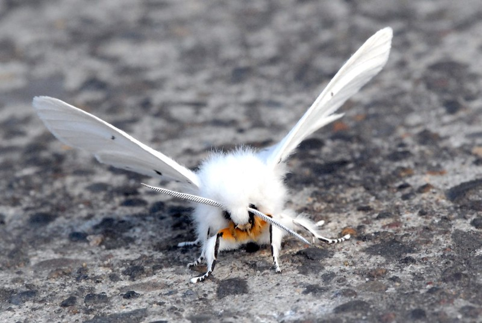
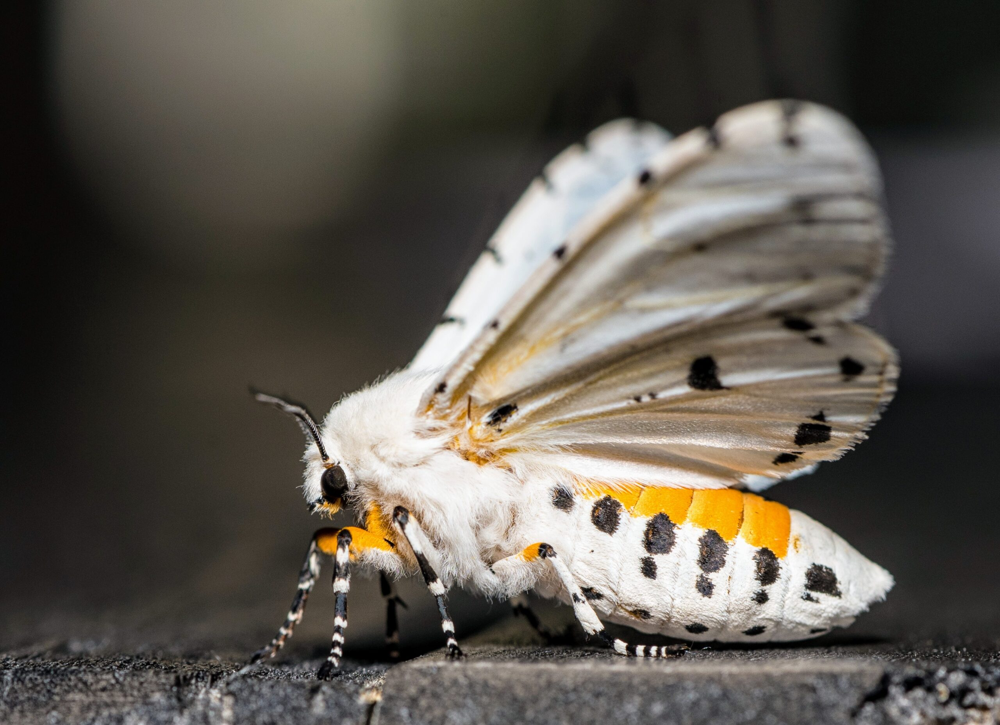
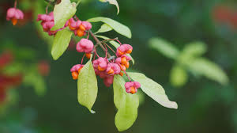
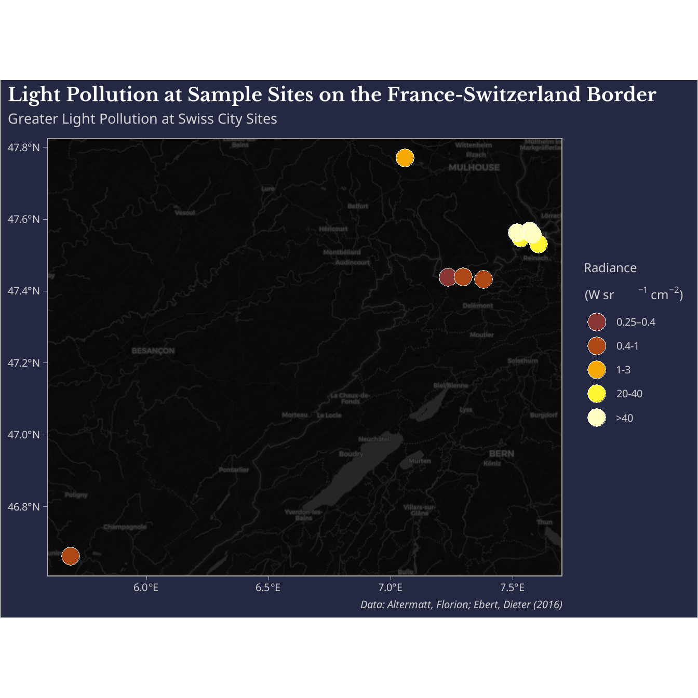
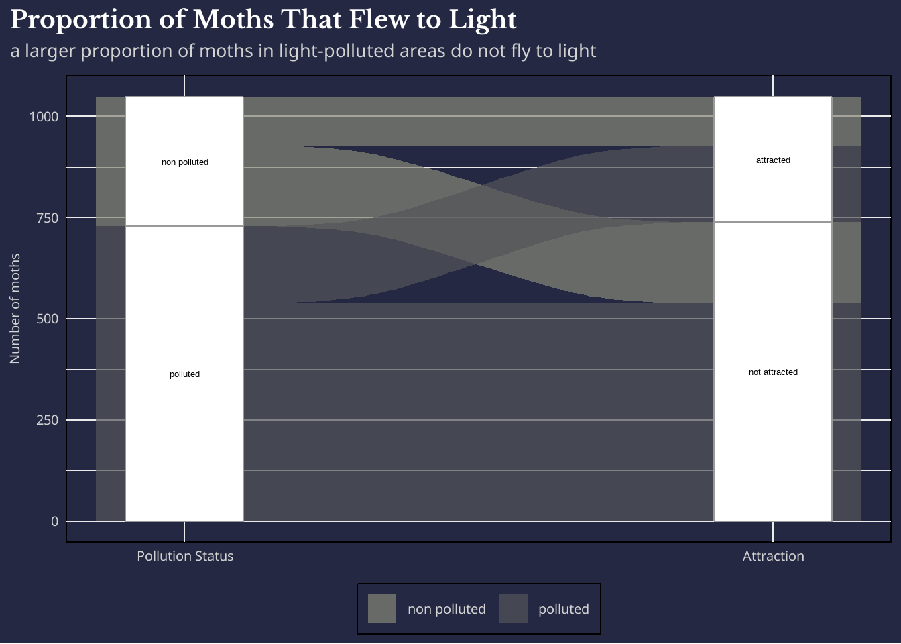
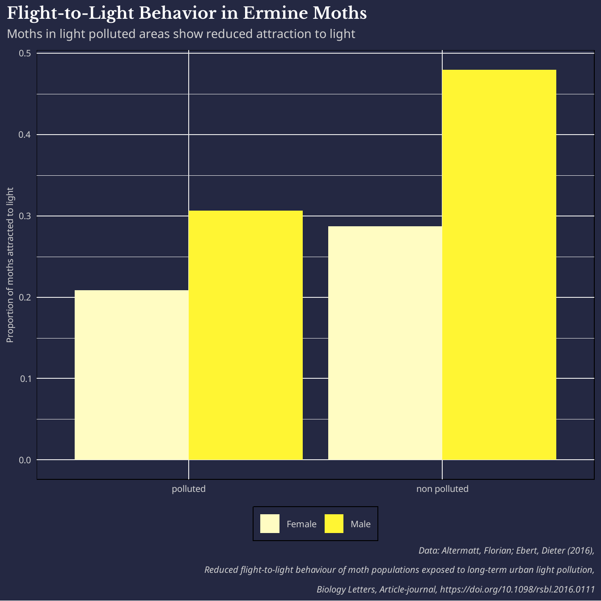
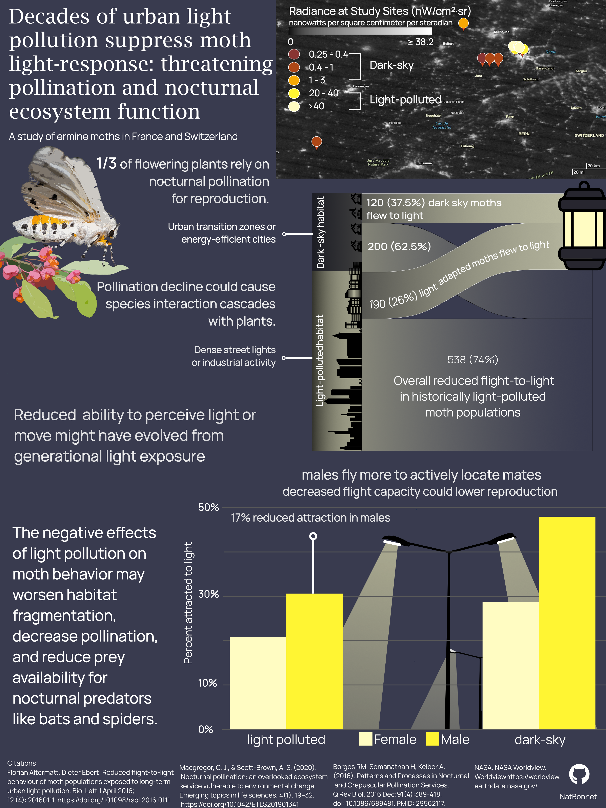

::: {style="text-align: center; margin: 2rem auto; max-width: 60%;"}
***"Thus hath the candle singed the moth."***

— William Shakespeare
:::

# Background Motivation

Pollination is widely recognized as an important ecosystem service, particularly through well-known insects like honey bees and bumblebees. However, much less attention is given to pollination that occurs at night. While daytime pollinators are incredibly important, approximately ⅓ of angiosperms (flowering plants) are pollinated by nocturnal animals [@borges2016]. 

This integral role supports species interaction networks that promote biodiversity, and contribute to human food security. Of these important pollinator groups, Lepidoptera (moths and butterflies) play a big part. Nocturnally active pollinators are largely overlooked in research due to many practical obstacles. Due to their important roles and known global species declines, it is important to understand anthropogenic drivers of nocturnal pollination decline such as light pollution [@macgregor2020].

Though limited, the existing body of knowledge suggest that light pollution has a significant negative effect on normal moth light attraction behavior.

# Case Study and Data
Using a study from the border of France and Switzerland [@altermatt2016] on the delightfully fairy-like spindle ermine moth (*Yponomeuta cagnagella*), I wanted to visualize how moths are impacted by urban light pollution, and showcase how this might influence vital ecosystems and services.

{fig-alt="Image of a ermine moth, a fuzzy white and black spotted moth with a bright orange underbelly."}

The data from the study can be found here: [Dryad](https://datadryad.org/dataset/doi:10.5061/dryad.v1885#citations)

# Goals

The elements of my final infographic aim to highlight the main findings of the study:

- Visualize how light-polluted vs. dark-sky moth populations differ in light attraction behavior
- Highlight the sex-based differences in this response
- Situate these findings in their broader ecological context: what this means for pollination, predation, and habitat connectivity

# Data Processing

One pre-visualization step I had to take to include all the information in the article was adding in coordinate information and light pollution bins/ their associated statuses (polluted or not polluted), as these were not directly provided in the data.

# Takeaways

I recreated the study results using the author's data by summarizing the overall attraction behavior of all moth populations, then separating flight counts by sex. 

The results showed that moth populations exposed to light pollution across decades are less attracted to light than those living in dark-sky regions. 

Male moths are more attracted to light than female moths. This means that they’re more likely to fly towards light in an experimental environment. This is likely because male moths must actively locate female mates. This could potentially be also impacting reproduction rates, contributing to a broader pattern of pollination decline. 

Disruption of natural moth navigation can have impacts on pollination rates, decrease food availability for nocturnal predators, and worsen habitat fragmentation effects.

To summarize these findings from my data exploration, I considered the following design elements:

# Design Elements

::: panel-tabset
## Graphic Form

In creating the final visual product, I considered the [@cleveland1984graphical] hierarchy of elementary perceptual tasks, which describes how people most accurately estimate values when looking at the position of data across a common scale. I chose a bar plot for this reason to summarize the main finding of the study. I also wanted to use a map to spatially contextualize the distances between study cities. These fairly basic plots allowed me to add more illustrative elements without overwhelming readers. My goal was to highlight the negative effects of light pollution on a subset of pollinators for readers who may not have an entemology background. 

## Text

Although I initially made text adjustments in R, I replaced all final text elements in Affinity at the end. Using Affinity allowed me to more quickly experiment with placements and typefaces.

## Icons

All icons used for visual interest were downloaded from the Noun Project. These vector icons I used are publicly accessible and made by the following artists.

{width=160px} 
{width=160px}
{width=160px} 
{width=160px} 
{width=160px} 
{width=160px}
{width=160px}

## Themes

I was going for an overall dark and modern theme. To do this I made certain color choices for contrast, and also removed or decreased the visual intensity of gridlines and labels to reduce noise in the final figure.

## Colors

When thinking about this infographic, I was motivated to use the natural colors from the spindle ermine moth and their associated plant: the European Spindle. I also wanted to use a night-sky color scheme for my background and lighting elements. My color palette ended up using a semi-illuminated grey blue to anchor all dark points to- as if you were looking at the night sky near a city. I also picked colors directly from these images of the ermine moth and plant. Using these colors, I also created my map radiance palette to fit the warm toned colors.

{width=300px}
{width=300px}

## Typography

With the dark color palette of my infographic, I wanted to minimize too much visual strain. I ended up using a sans-serif font called **Manrope** to get the job done, only changing the title text to distinguish it from the other text blocks.


## Layout

I used streetlight and lantern icons as both a thematic anchor and a structural device. This aimed to group the population-level and sex-disaggregated data visualizations beneath them to reinforce the study's core findings. Natural dividing lines between visual sections helped manage text without requiring heavy borders or boxes.

Size and weight (bold text, larger headers) guide the reader's eye through the infographic in a deliberate order: context → key finding → supporting detail.

## Contextualizing Data

Adding enough context for general audience to access the results of a dense scientific study was difficult. I played around with technical wording, and ultimately cut some detail from the final infographic text that clouded the main takeaways.

## Centering the Main Message

There were several things I did not understand from the study alone, so centering the primary takeaways around implications was more important than just interpreting the study results. I did this by trying to weave in connected topics such as plant pollination and other species interactions. 

## Accessibility

Especially due to the dark nature of the infographic, I chose other colors to emphasize contrast, and also picked my color palette with the use of **Coolors.com**, where you can export a color palette and apply colorblind filters to it to test for shade difference. 

:::

# Foundational Data Visualizations

Considering the visual elements detailed above, I chose to build my infographic on these plots:

### A Very Dark Map

{fig-alt="A dark colored map with colored points representing study site coordinates. The points are colored dark orange to light yellow to signify radiance. The study sites on the Swiss side of the map show greater light pollution (20 or more nanowatts per square centimeter per steradian)."}

My first map attempt plotted study sites colored by radiance bin. The standard basemaps I could access did not provide the overall light pollution trends I wanted to visualize. 

I decided to overlay study site coordinates directly onto **NASA's Black Marble night light imagery** [@nasa_worldview], which provided a real-data dark basemap. This let me show actual light pollution context while placing the radiance bins precisely where they were measured.

### Alluvial Flow Diagram
{fig-alt="An alluvial diagram representing decreased flight behavior towards light in moths from light-polluted areas."}

I wanted to visualize overall reduced flight to a light source in a flow diagram to visually mimic a moth's potential flight paths. I created a very simple alluvial diagram to do this. I changed design elements in Affinity to describe the moth population sources more intuitively, and included the lantern icon to emphasize the flight-to-light path.

### Bar Chart
{fig-alt="A bar chart showing bars representing female and male moths light attraction behavior compared between light-polluted and non light-polluted areas. Moths in polluted areas show an overall decreased attraction to light, with the greatest difference being between males 17%."}
This bar chart is essentially a recreation of the study's main figure with tweaks for interpretability. 

# Final Infographic

All component plots were built in R, then assembled and refined in **Affinity Designer by Canva**.

{fig-alt="Infographic describing a study on ermine moth populations. A map of study sites categorizes light pollution bins and study site locations. An alluvial flow diagram shows that a smaller proportion of moths from historically light-polluted areas fly towards a light source. A bar chart shows that male moths are more mobile (show more attraction) than female moths."}

# Initial Plot Code

The code chunk below is the complete workflow from reading in the orgiginal dataset to achieving the plots I used in Affinity.


```{r}
#| out-width: "100%"
#| fig.asp: 1
#| eval: false
#| echo: true
#| code-fold: true

# Load necessary libraries
library(tidyverse)
library(here)
library(janitor)
library(sf)
library(ggspatial)
library(prettymapr)
library(showtext)
library(ggalluvial)

# Add desired fonts
font_add_google(name = "Noto Sans", family = "noto_sans")
font_add_google("Libre Baskerville", family = "libre")

# Load in data and standardize column names
light_pol <- read.delim(here("posts", "ermine_moth_infographic", "data", "light_pol.txt"), skip = 2) %>%
  clean_names() %>%
  # Separate location column
  separate_wider_delim(
    cols = location_country,
    delim = "/",
    names = c("loc_name", "country")
  ) %>%
  # Remove any white space from separated columns
  mutate(country = str_squish(country), loc_name = str_squish(loc_name)) %>%
  # Rename population column to be more relevant
  rename(pollution_status = population) %>%
  # Recode values to be more intuitive
  mutate(
    pollution_status = recode(
      pollution_status,
      "dark-sky" = "non polluted",
      "light-polluted" = "polluted"
    ),
    # Recode country codes to full names
    country = recode(country, "F" = "France", "CH" = "Switzerland"),
    # Fix location name with conversion error
    loc_name = recode(loc_name, "Kleinl�tzel" = "Kleinlützel")
  ) %>%
  # Make a new column with pollution bin values
  mutate(
    pollution_bin = case_when(
      loc_name == "Blochmont"       ~ "0.25–0.4",
      loc_name == "Kleinlützel"     ~ "0.4-1",
      loc_name == "Kiffis"          ~ "0.4-1",
      loc_name == "Doucier"         ~ "0.4-1",
      loc_name == "Lutterbach"      ~ "1-3",
      loc_name == "Allschwil"       ~ "20-40",
      loc_name == "Reinach"         ~ "20-40",
      loc_name == "Hegenheim"       ~ ">40",
      loc_name == "Basel Kannenfeld" ~ ">40",
      loc_name == "Basel Spalentor" ~ ">40"
    ),
    # New Latitude and Longitude column with values from paper
    lat = case_when(
      loc_name == "Blochmont"        ~ 47 + 26 / 60 + 16 / 3600,
      loc_name == "Kleinlützel"      ~ 47 + 25 / 60 + 55 / 3600,
      loc_name == "Kiffis"           ~ 47 + 26 / 60 + 18 / 3600,
      loc_name == "Doucier"          ~ 46 + 39 / 60 + 40 / 3600,
      loc_name == "Lutterbach"       ~ 47 + 46 / 60 + 12 / 3600,
      loc_name == "Allschwil"        ~ 47 + 32 / 60 + 52 / 3600,
      loc_name == "Reinach"          ~ 47 + 31 / 60 + 50 / 3600,
      loc_name == "Hegenheim"        ~ 47 + 33 / 60 + 43 / 3600,
      loc_name == "Basel Kannenfeld" ~ 47 + 33 / 60 + 59 / 3600,
      loc_name == "Basel Spalentor"  ~ 47 + 33 / 60 + 28 / 3600
    ),
    lon = case_when(
      loc_name == "Blochmont"        ~  7 + 14 / 60 + 10 / 3600,
      loc_name == "Kleinlützel"      ~  7 + 22 / 60 + 57 / 3600,
      loc_name == "Kiffis"           ~  7 + 17 / 60 + 59 / 3600,
      loc_name == "Doucier"          ~  5 + 41 / 60 + 21 / 3600,
      loc_name == "Lutterbach"       ~  7 +  3 / 60 + 36 / 3600,
      loc_name == "Allschwil"        ~  7 + 32 / 60 +  8 / 3600,
      loc_name == "Reinach"          ~  7 + 36 / 60 + 25 / 3600,
      loc_name == "Hegenheim"        ~  7 + 31 / 60 + 14 / 3600,
      loc_name == "Basel Kannenfeld" ~  7 + 34 / 60 + 19 / 3600,
      loc_name == "Basel Spalentor"  ~  7 + 34 / 60 + 53 / 3600)) %>% 
  mutate(pollution_bin = factor(pollution_bin, levels = c("0.25–0.4", 
                                                           "0.4-1", 
                                                           "1-3", 
                                                           "20-40", 
                                                           ">40")
                                 )
         )

# Create sf object for mapping
light_pol_sf <- st_as_sf(light_pol, coords = c("lon", "lat"), crs = 4326)

# Enable font interp
showtext_auto(enable = TRUE)

# Create map
ggplot(light_pol_sf) +
  # Use OpenStreetMap basemap
  annotation_map_tile(type = "cartodark", zoomin = 0) +
  # Fill points by radiance measured
  geom_sf(
    aes(fill = pollution_bin),
    color = "white",
    size = 6,
    shape = 21
  ) +
  # Create custom radiance color scale
  scale_fill_manual(values = c("#893533", "#AE4716", "#F6A905", "#FFF533", "#FFFCC2")) +
  # Add labels
  labs(title = "Light Pollution at Sample Sites on the France-Switzerland Border",
       subtitle = "Greater Light Pollution at Swiss City Sites",
       caption = "Data: Altermatt, Florian; Ebert, Dieter (2016),\n Reduced flight-to-light behaviour of moth populations exposed to long-term urban light pollution,\n Biology Letters, Article-journal, https://doi.org/10.1098/rsbl.2016.0111") +
  theme_light() +
  # Add legend title
  guides(fill = guide_legend(
    # Legend title
    title = "Radiance\n(10–9 W sr–1 cm–2)"
  )) +
  # Create custom theme
  theme(
    plot.background = element_rect(fill = "#242842"), 
    panel.background = element_rect(fill = "#242842"), 
    legend.background = element_rect(fill = "#242842"), 
    
    # Align with y axis text instead of just axis
    plot.title.position = "plot",
    
    # Edit title format
    plot.title = element_text(
      face = "bold",
      family = "libre",
      size = 27,
      lineheight = 1.5, 
      color = "white"),
    
    # Subtitle format
    plot.subtitle = element_text(
      family = "noto_sans",
      size = 20,
      margin = margin(b = 8), 
      color = "lightgrey"),
    
    # Axis labels
    axis.text = element_text(size = 15,
      family = "noto_sans", 
      color = "lightgrey"),

    # Caption format
    plot.caption = element_text(
      family = "noto_sans",
      face = "italic",
      size = 15, color = "lightgrey"), 
    
    # Legend text and title format
    legend.text = element_text(size = 15,
      family = "noto_sans", color = "lightgrey"), 
    
    legend.title = element_text(size = 18,
      family = "noto_sans", color = "lightgrey")
    )
    

# Create pollution summary by status and sex- with proportion for attraction
pol_sum <- light_pol %>%
  group_by(pollution_status, sex) %>%
  summarise(
    total_attracted     = sum(moths_attracted),
    total_not_attracted = sum(moths_not_attracted),
    prop_attracted      = total_attracted / (total_attracted + total_not_attracted)
  ) %>%
  # Add better labels for sex
  mutate(pollution_status = factor(pollution_status, levels = c("polluted", "non polluted")),
         sex = recode(sex, 
                      "m" = "Male", 
                      "f" = "Female")) 

# Bar plot
ggplot(pol_sum, aes(x = pollution_status, y = prop_attracted, fill = sex)) +
  # Put sex columns next to each other instead of stacking
  geom_col(position = "dodge") +
  # Fill labels to look like light beams
  scale_fill_manual(values = c("#FFFCC2", "#FFF533")) +
  scale_y_continuous(labels = scales::percent)+
  # Add labels
  labs(title = "Flight-to-Light Behavior in Ermine Moths", 
       subtitle = "Moths in light polluted areas show reduced attraction to light", 
       caption = "Data: Altermatt & Dieter (2016)", 
       y = "Proportion of moths attracted to light")+
  theme_minimal() +
  # Apply custom theme
    theme(
      # Move legend to the bottom of the plot
      legend.position = "bottom", 
      
      # Remove axis title because it's redundant
      axis.title.x = element_blank(), 
      
      # Background colors
      plot.background = element_rect(fill = "#242842"),
      panel.background = element_rect(fill = "#242842"),
      legend.background = element_rect(fill = "#242842"),
      
      # Align with y axis text instead of just axis
      plot.title.position = "plot",
      
      # Title
      plot.title = element_text(
        face = "bold",
        family = "libre",
        # Size relative to base size in theme
        size = 27,
        lineheight = 1.5,
        color = "white"
      ),
      
      # Subtitle
      plot.subtitle = element_text(
        family = "noto_sans",
        size = 20,
        margin = margin(b = 8),
        color = "lightgrey"
      ),
      
      # Axis titles
      axis.title = element_text(
        size = 15,
        family = "noto_sans",
        color = "lightgrey"
      ), 
      
      # Axis labels
      axis.text = element_text(
        size = 15,
        family = "noto_sans",
        color = "lightgrey"
      ),
      
      # Caption
      plot.caption = element_text(
        family = "noto_sans",
        face = "italic",
        size = 15,
        color = "lightgrey"
      ),
      
      # Legend
      legend.text = element_text(
        size = 15,
        family = "noto_sans",
        color = "lightgrey"
      ),
      legend.title = element_blank()
      )

# Create dataframe for overall summary proportions
pol_tot_sum <- light_pol %>%
  group_by(pollution_status) %>%
  summarise(
    total_attracted     = sum(moths_attracted),
    total_not_attracted = sum(moths_not_attracted),
    prop_attracted      = total_attracted / (total_attracted + total_not_attracted)
  ) 

# Create stylized donut plot
ggplot(pol_tot_sum, aes(x = 2, y = prop_attracted, fill = pollution_status)) +
  geom_col(width = 1, color = "white") +
  # Make a donut
  coord_polar(theta = "y") +
  # Hole size
  xlim(0.01, 3) +
  
  # Remove all ticks and legend
  theme_void()+
  
  # Add custom colors
  scale_fill_manual(values = c("#FFF533", "#FFFCC2")) +
  
  # Add labels
  labs(title = "Long-Term Urban Light Pollution Effect on Ermine Moths")+
  
  # Add theme
    theme(
      plot.background = element_rect(fill = "#242842"),
      panel.background = element_rect(fill = "#242842"),
      legend.background = element_rect(fill = "#242842"),
      
      # Align with y axis text instead of just axis
      plot.title.position = "plot",
      
      # Title
      plot.title = element_text(
        face = "bold",
        family = "libre",
        # Size relative to base size in theme
        size = 27,
        lineheight = 1.5,
        color = "white"
      ),
      
      # Subtitle
      plot.subtitle = element_text(
        family = "noto_sans",
        size = 20,
        margin = margin(b = 8),
        color = "lightgrey"
      ),
    
      # Legend
      legend.text = element_text(
        size = 15,
        family = "noto_sans",
        color = "lightgrey"
      ),
      
      legend.title = element_blank()
      )

# Create a pivoted data frame to summarize attraction trends
df <- pol_tot_sum %>%
  # Remove the proportion column
  select(-prop_attracted) %>% 
  pivot_longer(
    # Pivot attracted and unattracted to one column called 'attraction'
    cols = c(total_attracted, total_not_attracted),
    names_to = 'attraction' ,
    # Summarize all count values
    values_to = 'count'
  ) %>% 
  # Recode for nicer plot output
  mutate(attraction = recode_factor(attraction, 
                                    total_attracted = "attracted", 
                                    total_not_attracted = "not attracted"))
# Create alluvial diagram using ggalluvial package
alluvial_plot <- ggplot(df,
  aes(axis1 = pollution_status, axis2 = attraction, y = count)) +
  geom_alluvium(aes(fill = pollution_status), width = 0.3, alpha = 0.7) +
  geom_stratum(width = 0.2, fill = "white", color = "grey60") +
  geom_text(stat = "stratum", aes(label = after_stat(stratum)),
            size = 3.5) +
  scale_fill_manual(values = c("#868677", "#535459")) +
  scale_x_discrete(limits = c("Pollution Status", "Attraction"),
                   expand = c(0.1, 0.1)) +
  labs(y = "Number of moths") +
  theme_minimal() +
  theme(legend.position = "none")

```
