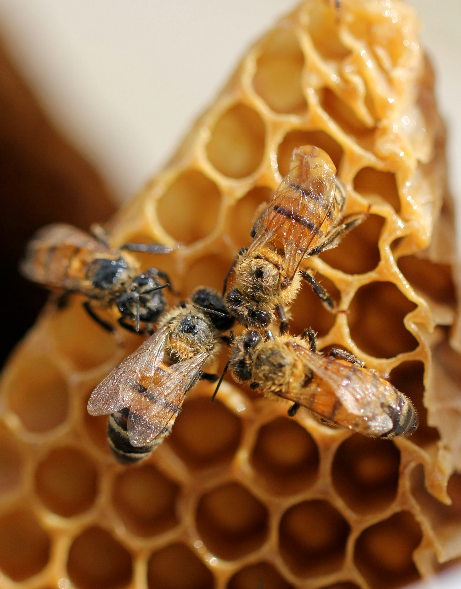

## Introduction and background
Our news landscape is supersaturated with warnings about chemicals that permeate everyday lives. Microplastics detected in human blood, ultra-processed foods are linked to cancer, we hear a near constant debate about the“health crisis in America”. Yet a pervasive and well documented threat to soil, water, wildlife, and human health has been largely ignored by U.S. regulators for decades. Neonicotinoid pesticides have raised alarms for nearly 25 years, with mounting evidence to support their restriction. Despite this, the main agency responsible for banning toxic chemicals, the Environmental Protection Agency (EPA) has continued to allow their sale and production.

Neonicotinoids (neonics) are systemic insecticides that target the central nervous system of invertebrates and are now the most widely used insecticides in the United States. Developed by Shell and Bayer in the 1980s as less acutely toxic alternatives to older pesticide classes, neonics differ from contact pesticides because they are absorbed by plants and distributed throughout all tissues. Leaves, flowers, roots, pollen, and nectar all contain the compound—making them highly effective but also environmentally persistent (European Commission 2020). 
Registered by the EPA in the early 1990s and widely adopted by the early 2000s, neonics quickly raised concerns about risks to non-target species, especially pollinators. Early EPA safety assessments relied mainly on short-term rat studies that did not address long-term exposure or the environmental behavior of toxic metabolites. A 2002 study estimated that less than 5% of applied neonics are absorbed by crop plants, with the vast majority dispersed into soil and water (Sur, Stork, and Störk 2002). Within a decade of widespread use, beekeepers and scientists were reporting mass bee die-offs linked to neonic-contaminated dust, soil, pollen, and nectar (Wood and Goulson 2017). 

## Research
Under the Federal Insecticide, Fungicide, and Rodenticide Act (FIFRA), EPA must reassess pesticide registrations every 15 years. Evidence of ecological harm began to grow in the early 2000s. After mass honey bee poisonings in Germany and Italy, the European Food Safety Authority (EFSA) conducted a 2012 risk assessment of three neonics used on bee-attractive crops. The European Commission responded in 2013 by restricting most outdoor uses of clothianidin, imidacloprid, and thiamethoxam, later proposing a full outdoor ban after further review. Based on EFSA's findings, the U.S. Center for Food Safety urged EPA to suspend these uses as early as 2013. Nonetheless, more than 100 neonic products remain registered in the U.S. today. 

Evidence of harm expands beyond ecological impacts. A recent study of 171 pregnant women in the U.S. and Puerto Rico found that over 90% of their sample group had detectable amounts of 5 analytes not currently included in NHANES (National Health and Nutrition Examination Survey) biomonitoring, including the neonicotinoid pesticide thiamethoxam. Further, neonicotinoids were widely detected in the pregnant women surveyed, with several compounds found in over 90% of participants. Notably, hispanic women were more likely to be affected (Buckley et al. 2022). Another 2019 study of over 3,000 participants in  NHANES found that almost 50% of the general population had detectable levels of at least one of six neonicotinoid biomarkers (Ospina et al. 2019). 

Despite rapidly accumulating evidence of exposure and harm, EPA action remains limited, while industry-funded studies continue to characterize neonics as safe. In 2016 pesticide industry scientists claimed neonics have “favorable safety profiles, due to their preferential affinity for nicotinic receptor (nAChR) subtypes in insects, poor penetration of the mammalian blood–brain barrier, and low application rates”. As a disclosure to address obvious concern for conflict of interest and industry sponsorship bias (Konno et al. 2024), The article disclosed that authors were employed or funded by neonic manufacturers, though they emphasized reliance on publicly available data, specifically from the EPA (Sheets et al. 2016). Bayer, the creator and manufacturer of many neonics, recently published a nearly 400 page document detailing studies conducted to assess the risk of Imidacloprid, including pollinator studies. The only two species of bee included in the studies were Apis (honey bees) and Bombus (bumble bees), concluding that mortality risks were minimal for honey bees in several studies (Bayer AG Crop Science Division 2023). Despite these fairly recent findings, the EPA released a statement in 2023 that clothianidin, imidacloprid and thiamethoxam were likely to jeopardize more than 200 species of plants and animals covered by the endangered species act (Center for Biological Diversity 2023).

## Case bias
Bias does not occur in a vacuum, and in a case as large and politically charged as neonicotinoid regulation, it is rarely attributable to a single source. As Konno et al. (2024) note, conflict of interest and industry sponsorship bias are clear concerns when a highly profitable, widely used chemical is regulated by agencies that interact closely with industry. Yet the issue of selection bias becomes clear here. Studies on opposite sides of the neonicotinoid debate often differ fundamentally in their design: some are conducted in situ within real ecosystems, while others rely on tightly controlled laboratory conditions. Many of the experimental studies I encountered exhibited undercoverage bias, limiting their observations to only one or 2 species (let alone genera) and manipulated hive conditions. Further, the issue of extractive logic is presented here (Vera et al. 2019). Narrowing study species, reducing ecological complexity, and ignoring lived or relational forms of knowledge, reproduces a “matrix of domination” that gives privilege to evidence that aligns with regulatory and industry priorities, sidelining ecological or community-based knowledge about harm. Laboratory studies report minimal harm while ignoring the ecological complexity and diversity of wild pollinators. Recent evidence highlights how significant this limitation is in entomological research, new evidence shows neonicotinoids have highly variable effects across and even within species, suggesting that current research does not accurately capture their true ecological impact (Nagloo et al. 2024).

## Response
To avoid reproducing these biases, regulatory agencies and industry leaders should follow the ethical precedent set by the EU in 2013: practice caution, consider broader ecological impacts, support independent research, and restrict use when evidence shows uncertain or potentially harmful risks. Although the polarized U.S. political climate makes similar action difficult, several states have taken action to address the dangers of persistent outdoor neonicotinoid use. Massachusetts (Healey 2017) and California (California Department of Commerce 2022) vocalized similar statements: we cannot feasibly test every additive effect of neonic treatments and their metabolites across plants, animals, and humans. The available evidence is sufficient to determine that the EPA cannot reasonably find that widespread use of neonicotinoids “will not generally cause unreasonable adverse effects on the environment.” This year, the Natural Resources Defense Council filed a lawsuit against the EPA for failing to act on a petition to revoke allowable “food tolerances” for neonics—permitted pesticide residues in food—arguing this inaction violates the Food, Drug, and Cosmetics Act (Natural Resources Defense Council 2025). The EPA’s reregistration for neonics is listed on their website as to be concluded by the end of 2025. As of December 10, they have not released any more decisions. 

## References
Bayer AG Crop Science Division. (2023). Imidacloprid bee studies - Compilation of study summaries. Monheim, Germany. 

Buckley, J. P., Kuiper, J. R., Bennett, D. H., Barrett, E. S., Bastain, T. M., Breton, C. V., Chinthakindi, S., Dunlop, A. L., Farzan, S. F., Herbstman, J. B., Karagas, M. R., Marsit, C. J., Meeker, J. D., Morello‐Frosch, R., O’Connor, T. G., Romano, M. E., Schantz, S. L., Schmidt, R. J., Watkins, D. J., & Zhu, H. (2022). Exposure to contemporary and emerging chemicals in commerce among pregnant women in the United States: The Environmental influences on Child Health Outcome (ECHO) Program. Environmental Science & Technology, 56. https://doi.org/10.1021/ACS.EST.1C08942

California Department of Commerce. (2022). Initial statement of reasons and public report: Department of Pesticide Regulation.

Center for Biological Diversity. (2023). EPA: Three popular neonicotinoid pesticides likely to drive more than 200 endangered plants, animals extinct. https://biologicaldiversity.org/w/news/press-releases/epa-three-popular-neonicotinoid-pesticides-likely-to-drive-more-than-200-endangered-plants-animals-extinct-2023-05-05/

Center for Food Safety. (2013). Center for Food Safety calls on EPA to follow European cue, find bee-killing insecticides unsafe. https://centerforfoodsafety.org/issues/304/pollinators-and-pesticides/press-releases/1248/center-for-food-safety-calls-on-epa-to-follow-european-cue-find-bee-killing-insecticides-unsafe

European Commission. (2020). Neonicotinoids. Food Safety. https://food.ec.europa.eu/plants/pesticides/approval-active-substances-safeners-and-synergists/renewal-approval/neonicotinoids_en

Healey, M. (2017, December 21). Notice of availability and request for comments on EPA’s risk assessments and benefits assessments for the registration reviews of imidacloprid, clothianidin, thiamethoxam, and dinotefuran (82 Fed. Reg. 60,599). Office of the Attorney General, Commonwealth of Massachusetts.

Konno, K., Gibbons, J., Lewis, R., & Pullin, A. S. (2024). Potential types of bias when estimating causal effects in environmental research and how to interpret them. Environmental Evidence, 13(1). https://doi.org/10.1186/s13750-024-00324-7

Nagloo, N., Rigosi, E., Herbertsson, L., & O’Carroll, D. C. (2024). Comparability of comparative toxicity: Insect sensitivity to imidacloprid reveals huge variations across species but also within species. Proceedings B, 291. https://doi.org/10.1098/RSPB.2023.2811

Natural Resources Defense Council. (2025). NRDC sues EPA for unreasonable delay in addressing toxic pesticides in food.https://www.nrdc.org/press-releases/nrdc-sues-epa-unreasonable-delay-addressing-toxic-pesticides-food

Ospina, M., Wong, L. Y., Baker, S. E., Serafim, A. B., Morales-Agudelo, P., & Calafat, A. M. (2019). Exposure to neonicotinoid insecticides in the U.S. general population: Data from the 2015–2016 National Health and Nutrition Examination Survey. Environmental Research, 176, 108555. https://doi.org/10.1016/j.envres.2019.108555

Sheets, L. P., Li, A. A., Minnema, D. J., Collier, R. H., Creek, M. R., & Peffer, R. C. (2016). A critical review of neonicotinoid insecticides for developmental neurotoxicity. Critical Reviews in Toxicology, 46(2). https://doi.org/10.3109/10408444.2015.1090948

Sur, R., Stork, A., & Störk, S. (2002). Uptake, translocation and metabolism of imidacloprid in plants. Bayer AG Crop Science Division. 

Vera, L. A., Walker, D., Murphy, M., Mansfield, B., Siad, L. M., & Ogden, J. (2019). When data justice and environmental justice meet: Formulating a response to extractive logic through environmental data justice. Information, Communication & Society, 22(7), 1012–1028. https://doi.org/10.1080/1369118x.2019.1596293

Wood, T. J., & Goulson, D. (2017). The environmental risks of neonicotinoid pesticides: A review of the evidence post-2013. Environmental Science and Pollution Research, 24(21). https://doi.org/10.1007/S11356-017-9240-X

